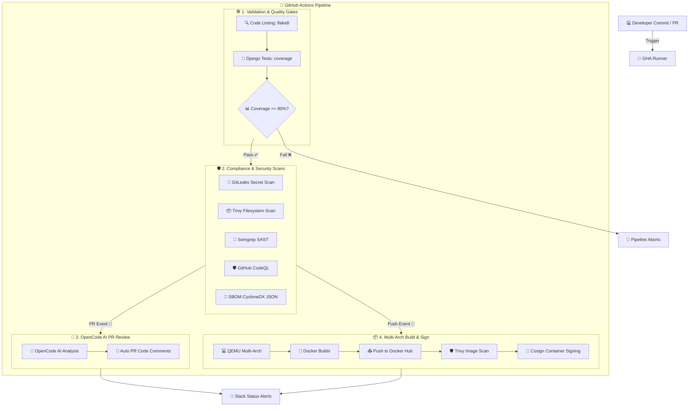

# 🚀 Enterprise CI/CD Pipeline Documentation

This project features an automated, production-ready CI/CD pipeline managed via **GitHub Actions** defined at [`.github/workflows/deploy.yml`](.github/workflows/deploy.yml). It is designed to enforce rigorous security checks, quality gates, automated testing, AI-powered review comments, and multi-architecture Docker image builds.

---

## 📖 What is CI/CD? An In-Depth Explanation

**CI/CD** is a combination of software engineering practices, cultural philosophies, and automation tools designed to manage the software release lifecycle. Instead of manually testing, compiling, securing, and deploying code, CI/CD automates these steps to deliver high-quality software quickly and reliably.

### 🧪 1. Continuous Integration (CI)
Continuous Integration is the practice of automating the integration of code changes from multiple developers into a single shared repository.
* **How it works**: Developers frequently commit and merge their code to a shared branch (like `DevOps` or `main`).
* **The Goal**: Catch issues early. Every commit triggers automated builds, syntax checks, and test suites. If a developer introduces a bug, the test suite catches it immediately, preventing broken code from accumulating in the codebase.
* **In this project**: Continuous Integration is handled by the **Validation** and **Security Scanning** stages. When you commit, GHA automatically runs:
  - Code syntax linting (`flake8`).
  - Unit tests and integration tests (`manage.py test`).
  - Code coverage gate (`coverage` verification $\ge 80\%$).
  - Dependency vulnerability and SAST scans (`Trivy`, `Semgrep`, `CodeQL`, `GitLeaks`).

### 📦 2. Continuous Delivery & Continuous Deployment (CD)
Although they share the abbreviation **CD**, they represent two different levels of automated deployment:
* **Continuous Delivery**: Automated processes prepare the codebase for deployment. Every code change that passes CI tests is automatically packaged (as a Docker image) and ready to deploy, but the actual release to production requires a **manual approval/trigger** (e.g. pushing a release tag).
* **Continuous Deployment**: Code changes are deployed to production automatically without human intervention as soon as they pass all testing gates.
* **In this project**:
  - We use **Continuous Deployment** for the **Staging environment**: Pushing code to `main` or `DevOps` automatically builds the Docker image, signs it, and runs verification checks.
  - We use **Continuous Delivery** for the **Production environment**: Production deployments are triggered selectively when you push a semantic version tag (e.g., `v1.2.0`), serving as a controlled, verifiable release.

### 🌟 Why Use CI/CD? (Key Benefits)
* **Velocity**: Code is integrated and built multiple times a day, allowing new features to reach users in minutes rather than weeks.
* **Consistency**: Deploys are executed exactly the same way every time by machines, eliminating human error (like forgetting to migrate the database or copy static assets).
* **Security & Quality Gates**: Code is scanned for security vulnerabilities, compliance, and test quality checks automatically on every change. Bad code is blocked before it reaches users.
* **Tight Feedback Loop**: Developers know within seconds if their code is valid and secure.

---

## 📐 Pipeline Architecture Flow

Below is the execution flow showing how commits and pull requests progress through the pipeline stages:



---

## 🛠️ Prerequisites: What You Need

Before triggering the pipeline, ensure you have:
1. **GitHub Account**: Access to your project repository.
2. **Docker Hub Account**: A registry username and password (or Access Token) to store built images.
3. **Slack Team & Webhook**: An active Slack channel with an *Incoming Webhook* URL to receive build alerts.
4. **OpenCode API Key**: An API key from OpenCode to authorize the AI-powered PR reviews.
5. **Cosign Keypair (Optional)**: If not using OIDC keyless signing, you will need a private key and passphrase.

---

## ⚙️ How It Works (Step-by-Step Details)

### 📊 Stage 1: Validation & Quality Gates (`validate`)
Enforces formatting standards and guarantees your codebase is fully tested.
* **🔍 Linting (Flake8)**: Scans python code for syntax errors, unused imports, or bad syntax. If any syntax errors are found, the pipeline stops.
* **🧪 Django Test Execution**: Runs `python manage.py test`. If any test case fails, the build terminates.
* **📏 Coverage Gate**: Runs `coverage report --fail-under=80`. If test coverage is below **80%**, the pipeline aborts.
* **📦 Report Artifacts**: Automatically compiles HTML and XML reports, uploading them as GHA artifacts (`coverage-report-html` and `coverage-report-xml`) kept for 14 days.

### 🛡️ Stage 2: Compliance & Security Scans (`security-scans`)
Runs standard scanners to detect secrets, vulnerable packages, and SAST bugs.
* **🔑 GitLeaks**: Scans git commit diffs to prevent accidental commits of secrets (API tokens, database strings, SSH keys).
* **📦 Trivy (FS)**: Audits your `requirements.txt` dependencies. Fails the build (`exit-code: 1`) if **High** or **Critical** vulnerabilities are found.
* **🔬 Semgrep SAST**: Scans Python code for injection bugs, hardcoded config settings, and Django anti-patterns.
* **🛡️ CodeQL SAST**: Initiates GitHub's deep SAST engine to identify code-level security issues.
* **📄 SBOM Compiler**: Generates a CycloneDX JSON file listing all active modules and libraries for dependency compliance audits.

### 🧠 Stage 3: AI Code Review (`ai-review`)
Provides automated code reviews directly on Pull Requests.
* **💬 Automated Comments**: Executed on PR events, runs the script [`.github/scripts/ai_review.py`](.github/scripts/ai_review.py) which analyzes the PR diff, evaluates Dockerfiles, Python files, and GHA workflows, and prints code optimization suggestions directly on the Pull Request.

### 🐳 Stage 4: Multi-Arch Build, Scan & Sign (`build-and-push`)
* **💻 QEMU & Buildx**: Prepares the build environment to build for both **`linux/amd64`** and **`linux/arm64`** platforms simultaneously.
* **📤 Docker Registry Push**: Publishes built images to your Docker Hub repository.
* **🛡️ Trivy Image Scan**: Scans the compiled container image layers for package-level vulnerabilities.
* **🔏 Cosign Container Signing**: Signs the image layers using GitHub's OIDC trust mechanism. This ensures that no untrusted or modified images can be run in your production clusters.

---

## 💻 How to Use the Pipeline (Daily Workflow)

### 🌿 Phase 1: Creating a Feature Branch & Testing Locally
Before pushing to GitHub, you should format your code and run tests locally:
```bash
# 1. Run local tests
python manage.py test

# 2. Check local coverage
coverage run manage.py test
coverage report
```

### 💬 Phase 2: Opening a Pull Request
1. Commit and push your feature branch:
   ```bash
   git checkout -b feature/polls-refactor
   git commit -m "feat: updated poll styling"
   git push origin feature/polls-refactor
   ```
2. Open a Pull Request on GitHub against `main` or `DevOps`.
3. **What happens**:
   - The validation engine checks if tests pass and coverage is $\ge 80\%$.
   - Security checkers verify no vulnerabilities or secrets are introduced.
   - **OpenCode AI** reviews your changes and leaves inline recommendations.
   - **Review this feedback** in the PR conversations tab.

### 🔀 Phase 3: Merging & Deploying to DevOps/main
1. Once code reviews pass, merge the Pull Request.
2. **What happens**:
   - The pipeline triggers a full multi-arch build.
   - The image is pushed to Docker Hub and signed with Cosign.
   - Slack posts a green alert to your DevOps channel.

### 🏷️ Phase 4: Cutting a Release Tag
1. To release a version (e.g. `v1.2.0`), run:
   ```bash
   git tag v1.2.0
   git push origin v1.2.0
   ```
2. **What happens**:
   - The pipeline validates that `v1.2.0` matches semantic versioning conventions.
   - A production build compiles and pushes `harshal001/django-polls-app:v1.2.0`.
   - A release announcement is posted to Slack.

---

## 📡 Monitoring Pipeline Artifacts & Reports

To review test logs and security scan findings:
1. Navigate to the **Actions** tab in your GitHub repository.
2. Click on the active or completed workflow run.
3. Scroll down to the **Artifacts** section to download:
   - `coverage-report-html` (Unzip and open `index.html` to inspect code lines that lack tests).
   - `trivy-fs-report` & `trivy-image-report` (Security findings in SARIF format).
   - `sbom-report` (Active bill of materials).
4. Click on **Job Summary** to view visual coverage and test results.

---

## 🚨 Troubleshooting Common Errors

### ❌ Error: `Coverage gate failed (under 80%)`
* **Fix**: Locate untested code by downloading the HTML coverage report. Write unit tests for views, model methods, or routes in `polls/tests.py` until the report coverage rises above 80%.

### ❌ Error: `GitLeaks Secret Scan detected credentials`
* **Fix**: Never commit credentials. Remove the password from the commit history using `git filter-repo` or `git reset` before pushing. Store the credential in GitHub Secrets instead.

### ❌ Error: `Trivy Vulnerability Scan failed`
* **Fix**: Check `trivy-fs-report` for package names. Open your `requirements.txt` file and upgrade the version to a secure release.
