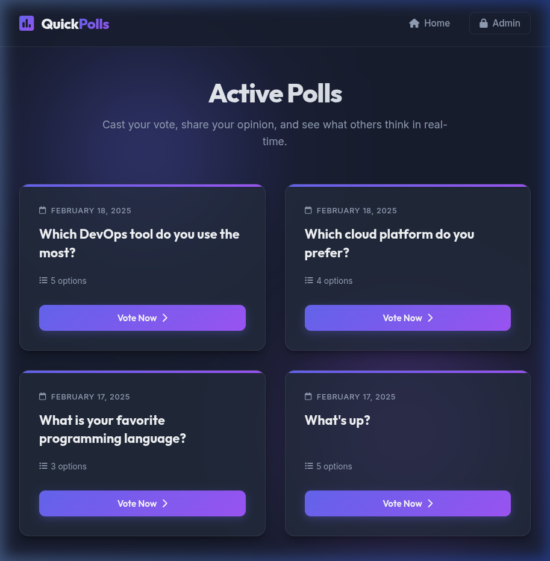

# QuickPolls - DevOps Poll App 🎯

A beautiful, modern Django-based web application that allows users to create, participate in, and analyze polls. This application features a premium dark-mode interface with a glassmorphic design, robust database migration pipelines, and is containerized and automated with CI/CD for cloud deployments.

---

## 📃 Project Description

QuickPolls features an interactive poll asking: **"Which DevOps tool do you use the most?"** Users can vote for industry-standard tools like Docker, Kubernetes, Jenkins, Terraform, and Ansible, and immediately view real-time graphical statistics of the voting results.

---

## 🔹 Features

- **Interactive Voting Dashboard**: Clean, responsive layout utilizing radio indicators and cards.
- **Real-Time Visual Results**: Live vote count calculation and stylized progress bars dynamically presenting percentages.
- **Premium Dark Mode & Glassmorphic UI**: Beautiful aesthetics built with Outfit & Inter typography, sleek gradients, and subtle hover animations.
- **Django Admin Panel Integration**: Fully integrated console at `/admin/` to manage questions, choices, and track live database objects.
- **Containerized Architecture**: Multi-stage `Dockerfile` and optimized `docker-compose.yml` defining separated Python (Gunicorn) and PostgreSQL database services.
- **Automated CI/CD Pipeline**: GitHub Actions workflow that automatically tests/builds the Docker image, pushes it to Docker Hub, and deploys it directly to a VPS.
- **Production Static Assets**: Pre-configured with WhiteNoise to collect and serve static files under production environments.

---

## 📆 Screenshots

### ✅ Active Polls Dashboard


---

## 📊 Technologies Used

- **Frontend**: HTML5, CSS3 (with Outfit/Inter Google Fonts and FontAwesome Icons)
- **Backend**: Django 5.1.3 (Python 3.13)
- **Database**: 
  - SQLite (Local development default)
  - PostgreSQL 16 (Production/Compose default)
- **Web/App Server**: Gunicorn 23.0.0
- **Static Hosting**: WhiteNoise
- **DevOps & CI/CD**: Docker, Docker Compose, GitHub Actions

---

## 📁 Installation & Running Guide

### Option A: Local Development (SQLite)

#### 1. Clone the Repository
```bash
git clone https://github.com/joshiharshal/devops-poll-app.git
cd Django-polls-app
```

#### 2. Set Up a Virtual Environment
```bash
python -m venv venv
source venv/bin/activate  # On Windows: venv\Scripts\activate
```

#### 3. Install Dependencies
```bash
pip install -r requirements.txt
```

#### 4. Run Migrations and Start Server
```bash
python manage.py migrate
python manage.py runserver
```

#### 5. View in Browser
Open your browser and navigate to: `http://127.0.0.1:8000/`

---

### Option B: Containerized Development (Docker Compose & PostgreSQL)

You can launch the entire stack—including the Django application and a PostgreSQL database—locally using Docker.

#### 1. Start Containers
```bash
docker compose up --build -d
```
*Note: The compose environment automatically runs migrations and hosts the web application with Gunicorn.*

#### 2. View in Browser
Open your browser and navigate to: `http://127.0.0.1:8000/`

---

## 🚀 CI/CD Pipeline (GitHub Actions)

This project has a pre-configured CI/CD workflow located at `.github/workflows/deploy.yml` that triggers on pushes to `main` and `DevOps` branches.

### Workflow Pipeline Steps:
1. **Build and Push**: Builds the production multi-stage Docker image and pushes it to Docker Hub under the tag `harshal001/django-polls-app`.
2. **Deploy to VPS**: Securely copies the `docker-compose.yml` to your VPS and runs `docker compose pull && docker compose up -d` to deploy.

### Required GitHub Secrets:
To use this pipeline, configure the following secrets in your GitHub repository settings:

| Secret | Description |
| --- | --- |
| **`DOCKER_HUB_USERNAME`** | Your Docker Hub username (e.g. `harshal001`) |
| **`DOCKER_HUB_ACCESS_TOKEN`** | Docker Hub Access Token (not your password) |
| **`VPS_HOST`** | Your VPS IP or domain (e.g. `192.168.x.x` or `server.example.com`) |
| **`VPS_USERNAME`** | VPS SSH username (e.g. `ubuntu`, `root`) |
| **`VPS_SSH_KEY`** | Your private SSH key (contents of `~/.ssh/id_ed25519` or `~/.ssh/id_rsa`) |
| **`VPS_DEPLOY_PATH`** | Directory on the VPS where `docker-compose.yml` should be copied (e.g. `/home/ubuntu/app`) |

---

## 🎡 Project Structure

```text
Django-polls-app/
├── .github/
│   └── workflows/
│       └── deploy.yml        # CI/CD deployment pipeline configuration
├── mysite/
│   ├── settings.py           # Core Django settings
│   ├── urls.py               # Main URL router
│   └── wsgi.py               # WSGI entrypoint for Gunicorn
├── polls/
│   ├── migrations/           # Database migration files
│   ├── static/               # CSS styles and static assets
│   ├── templates/            # Django template HTML views
│   ├── models.py             # Database schemas (Question, Choice)
│   ├── urls.py               # Poll routes
│   └── views.py              # Controller / View handlers
├── screenshots/
│   └── dashboard.png         # Active Polls Dashboard screenshot
├── Dockerfile                # Production multi-stage Docker container build
├── docker-compose.yml        # Docker Compose configuration (Django & PostgreSQL)
├── requirements.txt          # Python project dependencies
├── db.sqlite3                # SQLite database (local development)
└── README.md                 # Project documentation
```

docker build -t harshal001/django-polls-app:latest .
docker push harshal001/django-polls-app:latest
---

## 👥 Author

**Harshal**

GitHub: [@joshiharshal](https://github.com/joshiharshal)

---

## ✏️ License

- This project is licensed under the MIT License. Feel free to use, modify, and share it.
- See the LICENSE file for more details.